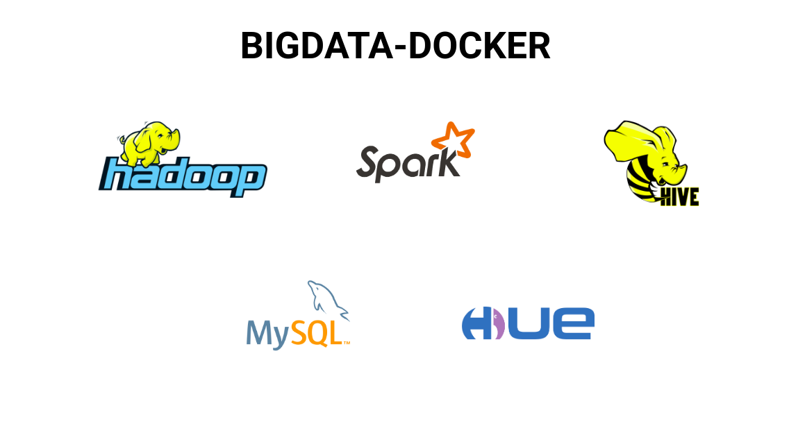

### Install Docker (Linux Ubuntu):

```shell
$ sudo apt-get remove docker docker-engine docker.io
$ sudo apt-get update
$ sudo apt-get install apt-transport-https ca-certificates  curl software-properties-common
$ curl -fsSL https://download.docker.com/linux/ubuntu/gpg | sudo apt-key add -
$ sudo apt-key fingerprint 0EBFCD88
$ sudo add-apt-repository "deb [arch=amd64] https://download.docker.com/linux/ubuntu $(lsb_release -cs) stable"
$ sudo apt-get update
$ sudo apt-get install docker-ce
$ sudo docker run hello-world
```

### Install Docker Compose

```shell
$ sudo curl -L "https://github.com/docker/compose/releases/download/1.23.2/docker-compose-$(uname -s)-$(uname -m)" -o /usr/local/bin/docker-compose
$ sudo chmod +x /usr/local/bin/docker-compose
```


### Build images
```shell
$ docker-compose build --parallel
```

### Up containers via compose
```shell
$ docker-compose up -d
```

### Up containers via swarm
```shell
docker swarm init --advertise-addr $(hostname -i)
docker stack deploy --compose-file docker-compose.yml hadoop
docker stack ls
docker stack services SERVICE_NAME
docker service ps SERVICE_NAME
docker stack rm hadoop
```

# Applications

Hadoop  	 - http://127.0.0.1:9870

Cluster:  	- http://127.0.0.1:8088

HDFS    	 - hdfs://127.0.0.1:9000

WEBHDFS 	 - http://127.0.0.1:14000/webhdfs/v1

Hive Server2 - http://127.0.0.1:10000

Hue - http://127.0.0.1:8888
	Username: hue
	Password: secret

Spark Master UI - http://127.0.0.1:4080

Spark Jobs - http://127.0.0.1:4040

Livy - http://127.0.0.1:8998

Jupyter notebook - http://127.0.0.1:8899

# Tutorials

## HDFS

### Access the Hadoop Namenode container
```shell
docker exec -it hadoop-master bash
```

### List root content
```shell
hadoop fs -ls /
```
### Create a directory structure
```shell
hadoop fs -mkdir /dados
hadoop fs -ls /
hadoop fs -ls /dados
hadoop fs -mkdir /dados/bigdata
hadoop fs -ls /dados
```

### Test the deletion of a directory
```shell
hadoop fs -rm -r /dados/bigdata
hadoop fs -ls /dados
```

### Add an external file to the cluster
```shell
cd /root
ls
hadoop fs -mkdir /dados/bigdata
hadoop fs -put /var/log/alternatives.log /dados/bigdata
hadoop fs -ls /dados/bigdata
```

### Copy files
```shell
hadoop fs -ls /dados/bigdata
hadoop fs -cp /dados/bigdata/alternatives.log /dados/bigdata/alternatives2.log
hadoop fs -ls /dados/bigdata
```

### List the contents of a file
```shell
hadoop fs -ls /dados/bigdata
hadoop fs -cat /dados/bigdata/alternatives.log
```
### Create a HUE User
```shell
hadoop fs -mkdir /user/hue
hadoop fs -ls /user/hue
hadoop fs -chmod 777 /user/hue
```

## Hive

### Access the Hadoop Namenode container
```shell
docker exec -it hadoop-master bash
```

### Run Hive Shell
```shell
hive
```

### List databases
```shell
> show databases;
```

### Access 'default' Database
```shell
> use default;
```

### List database tables
```shell
> show tables;
```

## Spark

Documentation: https://spark.apache.org/docs/latest/api/python/pyspark.sql.html?highlight=read%20csv

### Data ingestion in HDFS
```shell
# Access the Hadoio Namenode container
docker exec -it hadoop-master bash

# Download ENEM datasets: http://inep.gov.br/microdados

# create spark folder in HDFS
hadoop fs -mkdir /user/spark/

# Data ingestion in HDFS
hadoop fs -put  MICRODADOS_ENEM_2018.csv /user/spark/
hadoop fs -put  MICRODADOS_ENEM_2017.csv /user/spark/
```
### Access the Spark master node container
```shell
docker exec -it spark-master bash
```

### Access Spark shell
```shell
spark-shell
```

### Load ENEM 2018 data from HDFS
```shell
val df = spark.read.format("csv").option("sep", ";").option("inferSchema", "true").option("header", "true").load("hdfs://hadoop-master:9000/user/spark/MICRODADOS_ENEM_2018.csv")
```
### Show dataframe schema
```shell
df.printSchema()
```
### Show how many visually impaired students participated in the ENEM test in 2018.
```shell
df.groupBy("IN_CEGUEIRA").count().show()
```

### Show how many students participated in the ENEM test in 2018 grouped by age.
```shell
df.groupBy("NU_IDADE").count().sort(asc("NU_IDADE")).show(100, false)
```

## Kafka

### Connect Kafka Broker 1
```shell
docker exec -it kafka-broker1 bash
```

### Create topic
```shell
kafka-topics.sh --create --zookeeper zookeeper:2181 --replication-factor 1 --partitions 1 --topic test
```

### List topics
```shell
kafka-topics.sh --zookeeper zookeeper:2181 --list
```

### Run Producer on Kafka Broker 1
```shell
kafka-console-producer.sh --bootstrap-server kafka-broker1:9091 --topic test
```
### Enter data
```shell
>Hello
```

### Connect Kafka Broker 2
```shell
docker exec -it kafka-broker2 bash
```

### Run Consumer on Kafka Broker 2
```shell
kafka-console-consumer.sh --bootstrap-server kafka-broker1:9091 --from-beginning --topic test
```

### Delete topic
```shell
kafka-topics.sh --zookeeper zookeeper:2181 --delete --topic test
```
